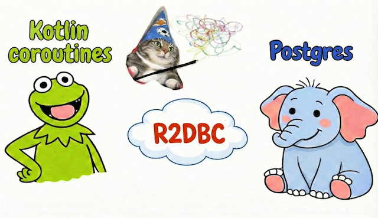

# R2DBC and coroutines



## Notes

The purpose of this demo is to showcase the use of reactive R2DBC drivers together with Kotlin coroutines.
Use of Project Reactor is kept to a minimum to maintain a coroutines-first approach.

### R2DBC
R2DBC drivers are database drivers that implement reactive, non-blocking access to relational databases.
In simple terms, they are the reactive alternative to JDBC drivers.
They have been around since about 2019 and have been steadily gaining popularity since then.
However, JDBC remains dominant in most applications because of its maturity, stability and simplicity.
This demo also aims to show that R2DBC usage can be straightforward in practice.

### Spring
Spring provides via `spring-boot-starter-data-r2dbc` the basic reactive tools to work with R2DBC drivers.
It also transitively includes the Project Reactor library, which provides the reactive types (Mono, Flux) and runtime used by Spring’s reactive APIs.

### JOOQ
In this demo we jOOQ to interact with the database.
jOOQ supports R2DBC drivers [since v3.15](https://blog.jooq.org/reactive-sql-with-jooq-3-15-and-r2dbc/)

The `spring-boot-starter-jooq` starter is not compatible because it uses JDBC.

A DSL Context object has to be configured and provided like
```kotlin
implementation("org.jooq:jooq")
implementation("org.jooq:jooq-kotlin-coroutines")
```
```kotlin
@Bean
fun dslContext(cf: io.r2dbc.spi.ConnectionFactory): org.jooq.DSLContext =
    DSL.using(cf, SQLDialect.POSTGRES)
```

### Flyway
Flyway has to be configured separately to have its own separate jdbc connection from configs like:
```yaml
spring:
  flyway:
    url: jdbc:postgresql://...
```

### Testcontainers
Testcontainers have to be configured to work with r2dbc:
```kotlin
testImplementation("org.testcontainers:testcontainers-r2dbc")
```

With the setup in place, let’s look at what changes in the code.

In reactive mode, a jOOQ Query returns `org.reactivestreams.Publisher<Record>`.
Publisher is defined by Reactive Streams, a standalone, technology-agnostic spec for asynchronous stream processing.
Project Reactor is a popular Java implementation of this spec.

Kotlin coroutines use a different model with suspending functions and Flow,
which are conceptually similar to Mono and Flux from Project Reactor.
Kotlin also provides a bridge library, `kotlinx-coroutines-reactive`,
that enables interoperability between Publisher (for example, a Flux from a jOOQ query) and coroutines.


A normal insert query
```kotlin
fun insert(aggregateType: String, aggregateId: String, payload: String): Long {
    return dsl.insertInto(table("outbox"))
        ...
        .fetchSingle()
```
becomes a suspending function
```kotlin
suspend fun insert(aggregateType: String, aggregateId: String, payload: String): Long {
    return dsl.insertInto(table)
        ...
        .awaitFirst()
```

A select query which returns a list of records
```kotlin
fun selectUnpublished(limit: Int): List<OutboxRecord> {
    return dsl.selectFrom(table)
        .where(field("published_at").isNull())
        .orderBy(field("id"))
        .limit(limit)
        .fetch { deser(it) }
}
```
becomes either a suspending function
```kotlin
suspend fun selectUnpublished(limit: Int): List<OutboxRecord> {
    val query = dsl.selectFrom(table("outbox"))
        .where(field("published_at").isNull())
        .orderBy(field("id"))
        .limit(limit)
    return Flux.from(query)
        .map { deser(it) }
        .collectList()
        .awaitSingle()
}
```
or a function that returns a Flow
```kotlin
fun selectUnpublishedAsFlow(limit: Int): Flow<OutboxRecord> {
    val query = dsl.selectFrom(table("outbox"))
        .where(field("published_at").isNull())
        .orderBy(field("id"))
        .limit(limit)
    return Flux.from(query)
        .asFlow()
        .map { deser(it) }
}
```

### Transaction management
[Since Spring 5.3](https://github.com/spring-projects/spring-framework/wiki/Spring-Framework-5.3-Release-Notes),
the Spring `@Transactional` is aware of Kotlin coroutines.
When a suspend function is marked `@Transactional`, Spring correctly manages the transaction context within the CoroutineContext.
NB: `@Transactional` in tests still is loking for JDBC Data source and does not work correctly.

###  Scheduling
[Starting with Spring 6.1](https://docs.spring.io/spring-framework/reference/integration/scheduling.html#scheduling-annotation-support-scheduled-reactive),
`@Scheduled` officially supports Kotlin suspend functions.


## Links
* Base for the demo is forked from the https://github.com/fyrkov/outbox-demo
* Reactive Streams specification: https://www.reactive-streams.org/
* Project Reactor https://projectreactor.io/docs
* Introduction of R2DBC to jOOQ: https://blog.jooq.org/reactive-sql-with-jooq-3-15-and-r2dbc/
